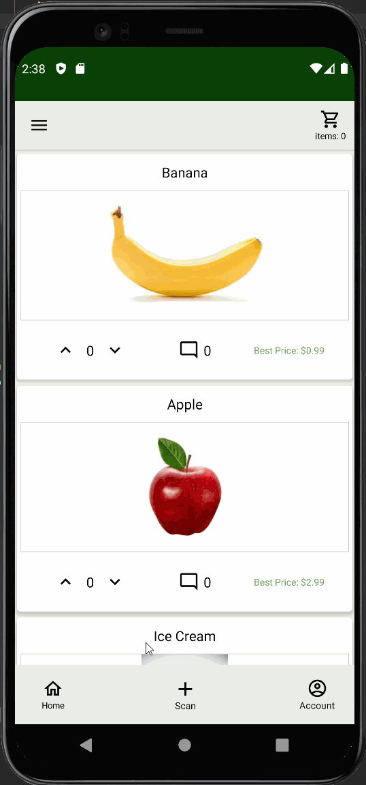
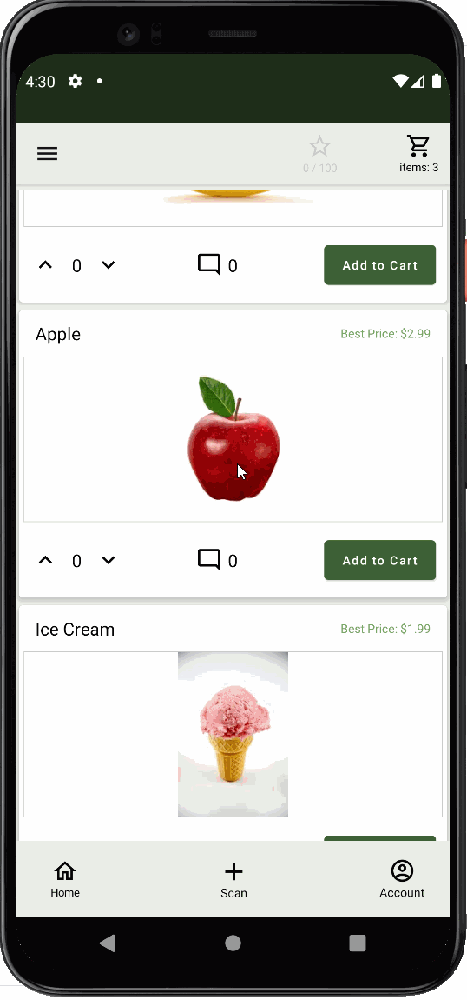
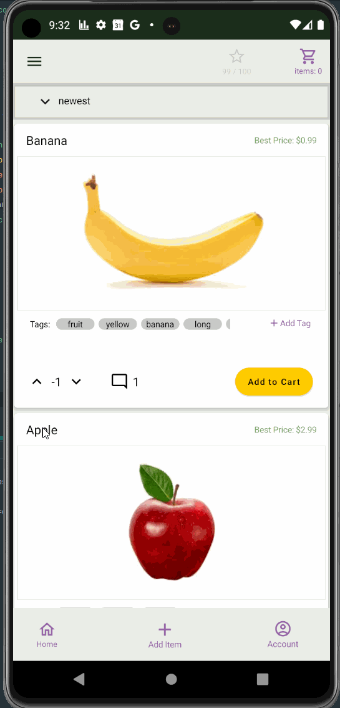

## Features
The following user stories are included:

* [x] Can leave comments per item.
* [x] Can add tags per unique item.
* [x] Can upvote and down vote posts.
* [x] Can capture images and store items in a database.
* [x] Can add price description and product name.
* [x] Shopping cart UI functionality, which collects all items and totals the price.
* [x] Account screen that allows for updating personal photo.

## Architecture
This application has a simple architecture. It uses a single activity and several fragments in the front end.
The front end stores local data in view models and then communicates with a backend server via repos to store and retrieve data in a database.

The database and middleware are built with Python, Django, and Heroku. This includes a custom built database with a unique CRUD operatoins
and SQL queries.

## Video Walkthroughs
We have included gifs that show different functionality of the app as it evolved.

**1**

**2**

**3**

**4**

**5**

The gifs were created with [LiceCap](http://www.cockos.com/licecap/).